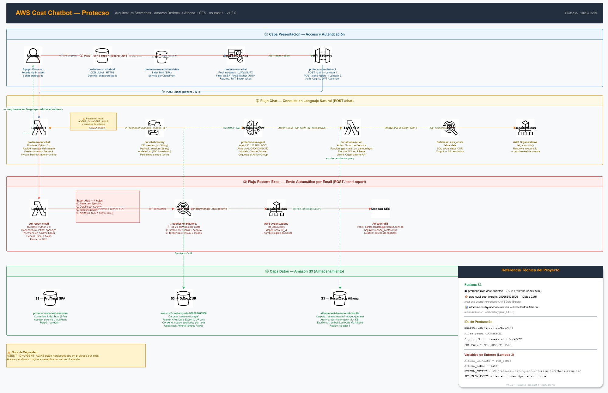

# 🤖 AWS Cost Chatbot — FinOps Intelligence

> Chatbot serverless para consultar, analizar y reportar costos AWS en lenguaje natural.  


---

## 📋 Tabla de Contenidos

- [El Problema](#-el-problema)
- [Solución](#-solución)
- [Arquitectura](#️-arquitectura)
- [Estructura del Repositorio](#-estructura-del-repositorio)
- [Componentes AWS](#-componentes-aws)
- [Lambdas — Detalle Técnico](#-lambdas--detalle-técnico)
- [Reporte Excel](#-reporte-excel)
- [Variables de Entorno](#️-variables-de-entorno)
- [Despliegue](#-despliegue)
- [Autenticación](#-autenticación)
- [Seguridad](#-seguridad)
- [Changelog](#-changelog)

---

## 🎯 El Problema

AWS Budget de la cuenta management enviaba alertas con el **monto total de la organización** pero sin desglose por cuenta ni servicio. Para obtener el detalle era necesario:

1. Ingresar manualmente a AWS Cost Explorer
2. Filtrar cuenta por cuenta
3. Exportar datos manualmente

Este proceso tomaba entre 20–40 minutos por reporte y requería acceso directo a la consola AWS.

---

## ✅ Solución

Un chatbot web seguro que permite a cualquier usuario autorizado hacer preguntas en lenguaje natural:

```
"¿Cuánto gastamos esta semana por cuenta?"
"¿Qué cuentas superaron los $500 USD?"
"¿Cuáles son los 3 servicios más caros del mes?"
```

Y recibir un **reporte Excel profesional por email** con un solo clic — sin necesidad de acceso a la consola AWS.

---

## 🏗️ Arquitectura

```
┌─────────────────────────────────────────────────────────────────────┐
│                        CAPA DE PRESENTACIÓN                         │
│                                                                     │
│   Usuario  ──▶  CloudFront (chat.protecso.io)  ──▶  S3 (SPA)       │
│                       Cognito JWT ──▶ API Gateway                   │
└──────────────────────────┬──────────────────────────────────────────┘
                           │
         ┌─────────────────┴────────────────────┐
         │                                      │
         ▼                                      ▼
  POST /chat                            POST /send-report
         │                                      │
         ▼                                      ▼
┌─────────────────┐                  ┌──────────────────────┐
│ Lambda          │                  │ Lambda               │
│ cur-chat        │                  │ cur-report-email     │
│                 │                  │                      │
│  DynamoDB       │                  │  Athena (3 queries)  │
│  (sesiones)     │                  │  Organizations       │
│       │         │                  │  openpyxl → .xlsx    │
│       ▼         │                  │  SES (email)         │
│  Bedrock Agent  │                  └──────────────────────┘
│  (Claude Sonnet)│
│       │         │
│       ▼         │
│  Lambda         │
│  athena-action  │
│  (Action Group) │
│       │         │
│       ▼         │
│  Athena SQL     │
│  Organizations  │
└─────────────────┘
```

> 📐 Ver arquitectura detallada en [`docs/ARCHITECTURE.md`](docs/ARCHITECTURE.md)



---

## 📁 Estructura del Repositorio

```
aws-cost-chatbot/
├── README.md                    ← Este archivo
├── CHANGELOG.md                 ← Historial de versiones
├── docs/
│   ├── ARCHITECTURE.md          ← Arquitectura detallada + diagramas
│   ├── DEPLOYMENT.md            ← Guía de despliegue completa
│   ├── bedrock-agent-setup.md   ← Cómo configurar el Bedrock Agent
│   └── athena-setup.md          ← Configuración CUR + Athena
├── src/
│   ├── chat/
│   │   ├── lambda_function.py   ← protecso-cur-chat (proxy a Bedrock)
│   │   └── requirements.txt     ← boto3
│   ├── report/
│   │   ├── lambda_function.py   ← protecso-cur-report-email
│   │   └── requirements.txt     ← boto3, openpyxl
│   └── athena_action/
│       ├── lambda_function.py   ← protecso-cur-athena-action
│       └── requirements.txt     ← boto3
├── frontend/
│   └── index.html               ← SPA (Cognito + chat + modal reporte)
├── iam/
│   └── lambda-policy.json       ← Política IAM documentada
├── .gitignore
└── .github/
    └── workflows/
        └── deploy.yml           ← CI/CD (GitHub Actions)
```

---

## 🔧 Componentes AWS

| Servicio | Nombre / ID | Rol |
|---|---|---|
| CloudFront | `protecso-cur-chat-cdn` | CDN · dominio `chat.protecso.io` |
| S3 (frontend) | bucket SPA | Hospeda `index.html` |
| Amazon Cognito | `protecso-cur-chat` · `us-east-1_koWyGhMTX` | Autenticación JWT |
| API Gateway | `protecso-cur-chat-api` | Rutas `/chat` y `/send-report` |
| Lambda chat | `protecso-cur-chat` | Proxy al Bedrock Agent + historial |
| Lambda report | `protecso-cur-report-email` | Athena → Excel → SES |
| Lambda action | `protecso-cur-athena-action` | Action Group de Bedrock |
| Bedrock Agent | `LDJKO1JVKY` · Alias prod: `QJONGN6CNC` | Claude Sonnet — razonamiento |
| DynamoDB | `cur-chat-history` | Sesiones de chat + historial de mensajes |
| Athena | DB: `aws_costs` · Tabla: `data` | SQL sobre datos CUR |
| S3 (datos) | `athena-cost-by-account-results` | CUR + resultados de Athena |
| Amazon SES | `daniel.cordero@protecso.com.pe` | Envío del reporte `.xlsx` |
| AWS Organizations | API `list_accounts` | Nombres reales de cuentas vinculadas |

---

## ⚡ Lambdas — Detalle Técnico

### 1. `protecso-cur-chat` — Chat Proxy

Recibe mensajes del frontend, gestiona la sesión Bedrock y persiste el historial.

**Flujo:**
```
API Gateway → JWT (Cognito claims) → DynamoDB (get session)
           → Bedrock Agent invoke → streaming response
           → DynamoDB (save session + messages)
```

**Acciones disponibles:**
- `action: "chat"` — enviar mensaje al agente
- `action: "get_history"` — recuperar historial del usuario
- `action: "clear_history"` — limpiar historial

**Runtime:** Python 3.12 | **Handler:** `lambda_function.lambda_handler`

---

### 2. `protecso-cur-report-email` — Generador de Reportes

Ejecuta 4 queries Athena, genera un Excel con openpyxl y lo envía por SES.

**Flujo:**
```
API Gateway → Athena (4 queries paralelas) → openpyxl → MIMEMultipart → SES
```

**Queries Athena:**
1. Costos por servicio — Top 20
2. Costos por cuenta + servicio
3. Tendencia mensual — últimos 6 meses
4. Costos diarios por cuenta (para alertas)

**Runtime:** Python 3.12 | **Layer:** `openpyxl-python312:1`

---

### 3. `protecso-cur-athena-action` — Bedrock Action Group

Ejecuta las consultas SQL que el agente Bedrock necesita para responder preguntas.

**Funciones expuestas al agente:**

| Función | Parámetros | Descripción |
|---|---|---|
| `get_costs_by_period` | `days`, `start_date`, `end_date` | Costos por cuenta y servicio |
| `get_cost_alerts` | `days`, `threshold` | Alertas de spike o acumulado > umbral |

**Runtime:** Python 3.12 | **Trigger:** Bedrock Agent Action Group

---

## 📊 Reporte Excel

El reporte `.xlsx` generado contiene **4 hojas**:

| Hoja | Contenido |
|---|---|
| **Resumen Ejecutivo** | Top 20 servicios · % del total · estado (Normal / Monitorear / Revisar) |
| **Detalle por Cuenta** | Desglose por cuenta AWS con nombres reales via Organizations |
| **Tendencia Mensual** | Últimos 6 meses por servicio + gráfico de barras |
| **Alertas Consumo +$500** | Caso 1: acumulado cruza $500 · Caso 2: incremento entre períodos > $500 |

---

## ⚙️ Variables de Entorno

### Lambda `protecso-cur-report-email`

| Variable | Valor | Descripción |
|---|---|---|
| `ATHENA_DATABASE` | `aws_costs` | Base de datos Athena |
| `ATHENA_TABLE` | `data` | Tabla con datos CUR |
| `ATHENA_OUTPUT` | `s3://athena-cost-by-account-results/athena-results/` | Resultados de queries |
| `SES_FROM_EMAIL` | `daniel.cordero@protecso.com.pe` | Remitente verificado en SES |

### Lambda `protecso-cur-chat`

| Variable | Descripción |
|---|---|
| `AGENT_ID` | ID del Bedrock Agent (`LDJKO1JVKY`) |
| `AGENT_ALIAS` | Alias de producción (`QJONGN6CNC`) |
| `HISTORY_TABLE` | Nombre de la tabla DynamoDB (`cur-chat-history`) |

---

## 🚀 Despliegue

Ver guía completa en [`docs/DEPLOYMENT.md`](docs/DEPLOYMENT.md).

**Resumen rápido:**

```bash
# 1. Lambda chat (sin dependencias externas)
cd src/chat && zip function.zip lambda_function.py
aws lambda update-function-code \
  --function-name protecso-cur-chat \
  --zip-file fileb://function.zip --region us-east-1

# 2. Lambda report (requiere openpyxl como Lambda Layer)
cd src/report && zip function.zip lambda_function.py
aws lambda update-function-code \
  --function-name protecso-cur-report-email \
  --zip-file fileb://function.zip --region us-east-1

# 3. Frontend
aws s3 cp frontend/index.html s3://<BUCKET_FRONTEND>/
aws cloudfront create-invalidation --distribution-id <DIST_ID> --paths "/*"
```

---

## 🔐 Autenticación

El sistema usa **Amazon Cognito** con flujo `USER_PASSWORD_AUTH`:

- User Pool: `us-east-1_koWyGhMTX`
- Client ID: `9bk0lu8ablftqsbojch52qfhv` (público por diseño de SPA)
- Token de sesión: **60 minutos** con timer visible en la UI
- Refresh Token: 5 días (renovación automática)
- Primer login: fuerza cambio de contraseña (`NEW_PASSWORD_REQUIRED`)

---

## 🛡️ Seguridad

- ✅ Todas las rutas de API Gateway protegidas con JWT (Cognito Authorizer)
- ✅ Variables sensibles en environment variables de Lambda (no hardcodeadas)
- ✅ Bucket S3 de datos sin acceso público
- ✅ `.gitignore` excluye `.env`, credenciales y artefactos de build
- ⚠️ `AGENT_ID` / `AGENT_ALIAS` deben mantenerse como variables de entorno (no commitear)

---

## 📄 Changelog

Ver [`CHANGELOG.md`](CHANGELOG.md) para el historial completo de versiones.

---

## 👤 Autor

**Daniel Cordero** · Protecso  
`daniel.cordero@protecso.com.pe`  

---

*Generado y mantenido con el skill `github-documenter` para Claude.ai*
